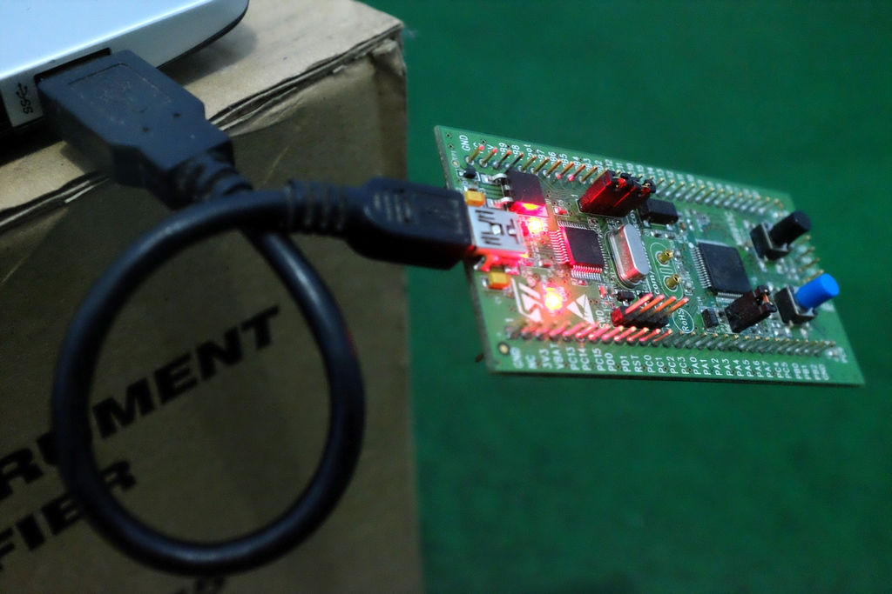
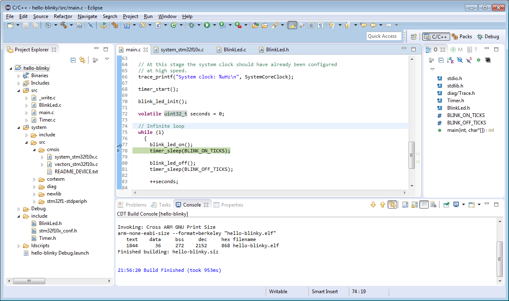
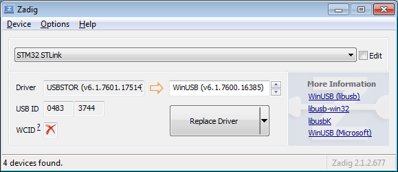
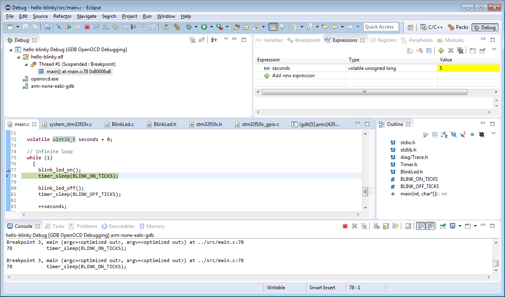

# Brief
- [STM32VLDISCOVERY Product page](http://www.st.com/web/en/catalog/tools/FM116/SC959/SS1532/PF250863?sc=stm32-discovery)
- [STM32F100RB microcontroller](http://www.st.com/web/catalog/mmc/FM141/SC1169/SS1031/LN775/PF216844?sc=internet/mcu/product/216844.jsp)
  - ARM®32-bit Cortex®-M3 CPU
  - 128 KB Flash, 8 KB RAM
  - Medium-density device
- STLINK v1 interface, SWD connection to the microcontroller
- Tools: 
  - [Eclipse IDE for C/C++ Developers](https://eclipse.org/downloads/)
  - [GNU ARM Eclipse plug-in](http://gnuarmeclipse.livius.net/)
  - [ARM GCC toolchain](http://launchpad.net/gcc-arm-embedded)
  - [Build tools for Windows](https://sourceforge.net/projects/gnuarmeclipse/files/Build%20Tools/)
  - [OpenOCD debugger](http://sourceforge.net/projects/gnuarmeclipse/files/OpenOCD/Windows)
  - [STLINK driver](http://www.st.com/web/en/catalog/tools/PF260219)
  - [Zadig](http://zadig.akeo.ie/)
  - Windows 7

# Install toolchain, Eclipse and plugin
- References:
  - [How to use](http://gnuarmeclipse.livius.net/blog/use/)
  - [Build tools for Windows](http://gnuarmeclipse.livius.net/blog/build-tools-windows/)
  - [Plug-in installation](http://gnuarmeclipse.livius.net/blog/plugins-install/)
- Install **toolchain** (`gcc-arm-none-eabi-4_9-2015q2-20150609-win32.exe`) and **build tools** (`gnuarmeclipse-build-tools-win32-2.4-201503242026-setup.exe`)
- Install **Eclipse** (`eclipse-cpp-mars-R-win32-x86_64.zip`)
- Install **GNU ARM Eclipse plugin**
  - Help - Install New Software...
  - Add new repo: `GNU ARM Eclipse Plug-ins (http://gnuarmeclipse.sourceforge.net/updates)`
  - Install the plugins
- Set [workspace preferences](http://gnuarmeclipse.livius.net/blog/workspace-preferences/)

# Setup Packs -- optional
- Reference: [Packs manager](http://gnuarmeclipse.livius.net/blog/packs-manager/)
- Go to **Packs** perspective, click *refresh*
- Install the packs needed (**STM32F1xx_DFP**)
  - To see the progress, look at the status bar on the bottom right 
- Back to C/C++ perspective, [assign device to project](http://gnuarmeclipse.livius.net/blog/assign-device-project/)
- Note: it seems that Packs is still not used in build process in current version of GNU ARM Eclipse plugin (`1.0.0.7X7s7icNPLHh8Ecy9dreSyo_r`) 

# Hello Blinky
- Reference: [STM32F template](http://gnuarmeclipse.livius.net/blog/stm32f-template/)
- New C (or C++) project, use type **STM32F10x C/C++ project** using **Cross ARM GCC**
  - Chip family: **STM32f10x Medium Density**
  - Flash size (KB): **128**
  - RAM size (KB): **8**
  - External clock (Hz): **8000000**
  - Content: **Blinky (blink a led)**
  - Use system calls: **Freestanding (no POSIX system calls)**
  - Trace output: **None (no trace output)**
- Build the project, verify that the build succeeded

  - Q: where is the linker script?
- Use **STM32 ST-LINK Utility** to Program the .hex file to the device --> Nothing happens . . .
- Need to modify clock settings and GPIO assignment:
  - In `system/src/cmsis/system_stm32f10x.c`
    - Comment out `#define SYSCLK_FREQ_72MHz  72000000` -- sets clock to default (*HSI, high speed internal oscillator*, 8 MHz nominal)
    - **_TODO:_** figure out how to setup external clock / PLL
  - In `src/BlinkLed.h`
    - Set `#define BLINK_PORT_NUMBER` to `(2)` -- PORTC
    - Set `#define BLINK_PIN_NUMBER` to `(8)` or `(9)` -- blue or green LED on STM32VLDISCOVERY board, respectively
- Redo programming using ST-LINK --> **OK**, now LED blinks at 1 second interval!
  - Try disconnecting the 8 MHz crystal on board: LED still blinks, confirming that HSI is the active oscillator

  
# Install OpenOCD
- Reference: [OpenOCD install](http://gnuarmeclipse.livius.net/blog/openocd-install/)
- Install **STLINK driver** (`stsw-link009/stlink_winusb_install.bat`)
- Using **Zadig** (`zadig_2.1.2.exe`)
  - *Options - List All Devices*
  - Select *STM32 STLink* from the dropdown
  - Change the driver to *WinUSB (v6.1.7600.16385)* -- or later version, click *Replace Driver*

  - On the first time, Zadig reported failed to install the driver (timeout after ~5 minutes), but after reconnecting the board now it is listed as *Universal Serial Bus devices - STM32 STLink* in Device Manager
    - Not sure if this is a normal behavior
    - Also now the board is not detected by STM32 ST-LINK Utility
  - To restore the original driver: uninstall driver in Device Manager, make sure that *Delete the driver software for this device* is checked
  - Second time using Zadig, driver installed successfully
- Install **OpenOCD** (`gnuarmeclipse-openocd-win32-0.9.0-201505190955-setup.exe`)
  - Verify that OpenOCD works:
<pre><code>
C:\Program Files (x86)\GNU ARM Eclipse\OpenOCD\0.9.0-201505190955\bin>openocd -f board/stm32vldiscovery.cfg
GNU ARM Eclipse 32-bits Open On-Chip Debugger 0.9.0-00073-gdd34716-dirty (2015-05-19-09:56)
Licensed under GNU GPL v2
For bug reports, read
        http://openocd.org/doc/doxygen/bugs.html
Info : The selected transport took over low-level target control. The results might differ compared to plain JTAG/SWD
adapter speed: 1000 kHz
adapter_nsrst_delay: 100
none separate
srst_only separate srst_nogate srst_open_drain connect_deassert_srst
Info : Unable to match requested speed 1000 kHz, using 950 kHz
Info : Unable to match requested speed 1000 kHz, using 950 kHz
Info : clock speed 950 kHz
Info : STLINK v1 JTAG v13 API v2 SWIM v0 VID 0x0483 PID 0x3744
Info : using stlink api v2
Info : stm32f1x.cpu: hardware has 6 breakpoints, 4 watchpoints
</code></pre>

# Using the OpenOCD plugin
- Reference: [OpenOCD debugging](http://gnuarmeclipse.livius.net/blog/openocd-debugging/)
- Setup debugging configuration using *Run - Debug Configurations...*, then start debugging using *Debug*
  - **Debugging works!** Single step, breakpoint, watch expression . . .

- The debugging speed is rather slow
  - To increase, edit `C:\Program Files (x86)\GNU ARM Eclipse\OpenOCD\0.9.0-201505190955\scripts\board\stm32vldiscovery.cfg`, add this line: `adapter_khz 20000`
    - 20000 is just an arbitrary large number
  - When running the OpenOCD, now the debugger runs at 4000 kHz (apparently it is limited to half of clock frequency)
<pre><code>
C:\Program Files (x86)\GNU ARM Eclipse\OpenOCD\0.9.0-201505190955\bin>openocd.exe -f board/stm32vldiscovery.cfg
GNU ARM Eclipse 32-bits Open On-Chip Debugger 0.9.0-00073-gdd34716-dirty (2015-05-19-09:56)
Licensed under GNU GPL v2
For bug reports, read
        http://openocd.org/doc/doxygen/bugs.html
Info : The selected transport took over low-level target control. The results might differ compared to plain JTAG/SWD
adapter speed: 1000 kHz
adapter_nsrst_delay: 100
none separate
adapter speed: 20000 kHz
srst_only separate srst_nogate srst_open_drain connect_deassert_srst
Info : Unable to match requested speed 20000 kHz, using 4000 kHz
Info : Unable to match requested speed 20000 kHz, using 4000 kHz
Info : clock speed 4000 kHz
Info : STLINK v1 JTAG v13 API v2 SWIM v0 VID 0x0483 PID 0x3744
Info : using stlink api v2
Info : stm32f1x.cpu: hardware has 6 breakpoints, 4 watchpoints
</code></pre>
